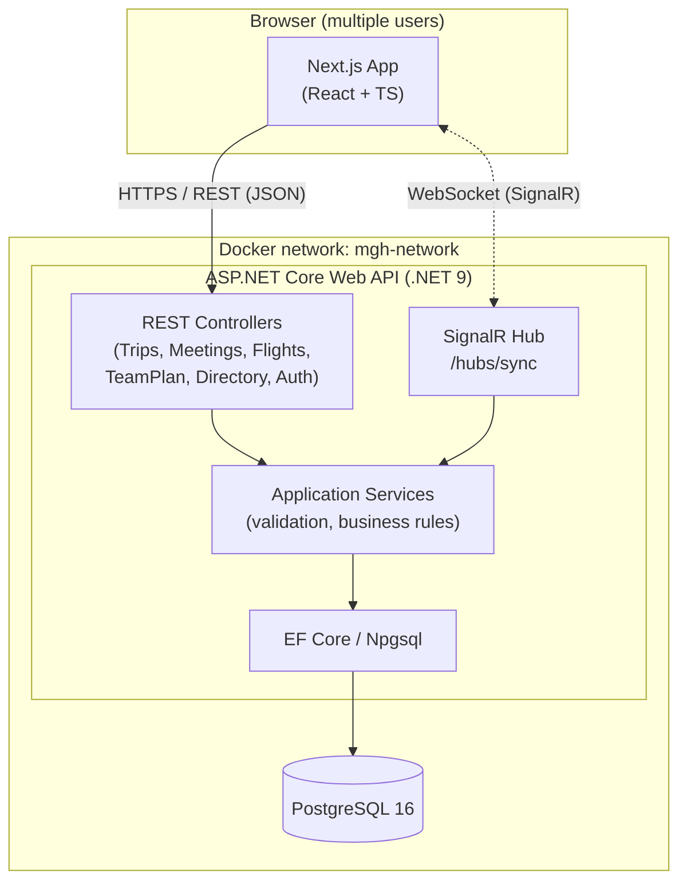
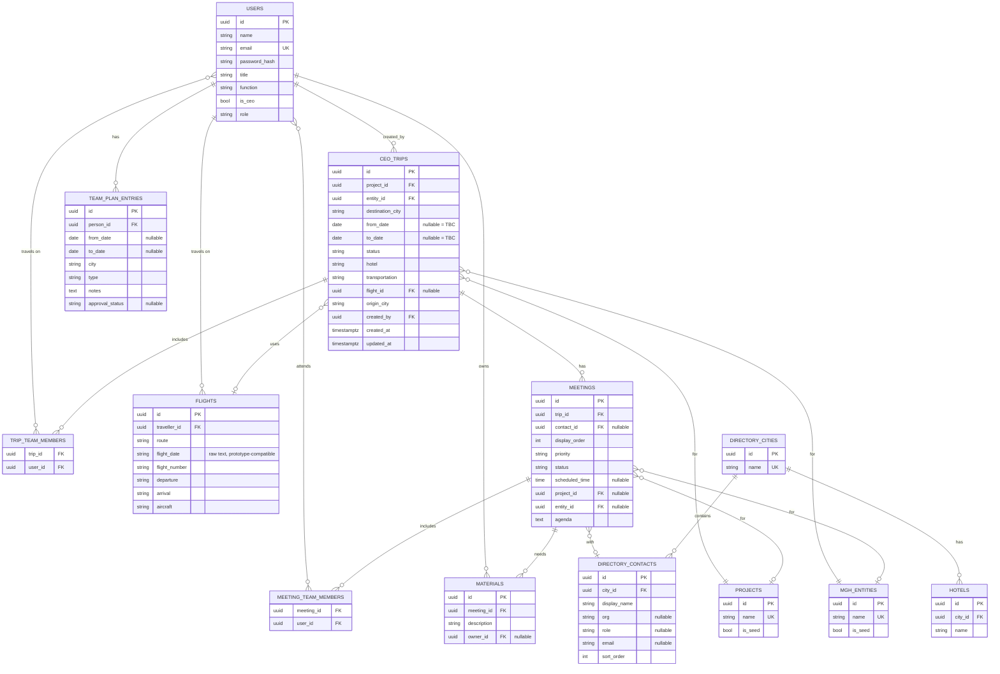
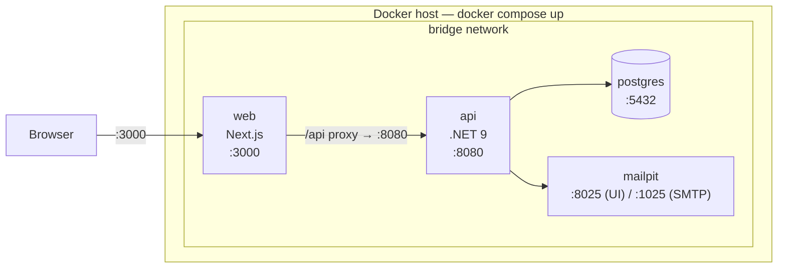

# TRD.md — Technical Requirements Document
## MGH Travel Portal — Rebuild

**Stack:** Next.js (TypeScript) · ASP.NET Core (.NET 9) Web API · PostgreSQL · SignalR (WebSockets) · Docker Compose

---

## 1. System Architecture

### 1.1 Overview

Three-tier architecture: a Next.js frontend, a stateless .NET 9 Web API backend, and a PostgreSQL database as the single source of truth (replacing the prototype's `localStorage`). A SignalR hub runs inside the API process and pushes change events to all connected clients over WebSockets, so every browser tab reflects edits made by anyone else within seconds — no manual refresh, no polling.



**Request flow (write path):**
1. Client calls a REST endpoint (e.g. `POST /api/trips`).
2. Controller validates the request shape; the application service enforces business rules (date ordering, required destination, etc.).
3. EF Core persists the change inside a transaction.
4. On success, the service publishes a change event to the SignalR hub, which broadcasts a small payload (entity type + id + action) to all connected clients.
5. Clients that receive the event either patch their local cache or re-fetch the affected resource — the payload is a pointer, not the full state, to keep hub messages small.

**Why this shape:** the prototype's logic (calendar drill-down, one-pager generation, days-by-country aggregation) is presentation logic and stays in the frontend. The backend's job is to be a clean, validated source of truth and to fan out change notifications — it does not need to know about calendar rendering.

### 1.2 Component Responsibilities

| Layer | Responsibility |
|---|---|
| Next.js (frontend) | All UI/UX from the prototype: calendar drill-down, one-pager rendering/print, form validation (mirrored, not trusted), client-side derived state (KPIs, days-by-country) computed from API data |
| ASP.NET Core API | Auth (JWT issuance), CRUD for all entities, business-rule validation (server is the source of truth for validation, not just the client), SignalR hub for live sync, export/import/reset endpoints |
| PostgreSQL | Durable storage, referential integrity (FKs replace the prototype's implicit string-matching), constraints as a second line of defense (e.g. `CHECK (to_date >= from_date)`) |
| Docker Compose | Reproducible local/dev environment: one command builds and starts all three, applies EF Core migrations, and seeds demo data equivalent to the prototype's `DEFAULT_STATE` |

---

## 2. Database Design

### 2.1 Entity-Relationship Diagram



### 2.2 Schema Notes

- **UUIDs over serial ints:** the prototype uses names as identifiers in places; UUIDs avoid rename/collision issues and are safe to generate client-side optimistically if needed later.
- **"Other (type new)" fields (project, entity, hotel, city):** modeled as real reference tables (`projects`, `mgh_entities`, `hotels`) rather than string enums. When a user types a custom value, the API upserts a row (`is_seed = false`) and returns its id — this keeps trips/meetings referentially clean while still supporting free-text growth, and means the "custom" list is durable across sessions instead of being re-typed each time.
- **Deduplication rule (prototype rule #8):** a person's CEO-trip participation and their Team Plan entries are never merged into one row in the DB — the calendar endpoint computes the union at read time (see §2.3) so trip participation is derived, not double-stored.
- **Nullable dates:** `from_date`/`to_date` stay nullable to preserve the "TBC" concept from the prototype.
- **Flight `flight_date` as text:** kept as free text (not `date`) to preserve the prototype's dual format support (ISO or "23 Jun 2026"); a computed/parsed sort key can be added later if strict sorting is needed — flagged as a known trade-off, not solved in v1.

### 2.3 Key Constraints & Derived Data

```sql
-- Date ordering (business rule #1), enforced at the DB as a second line of defense
ALTER TABLE ceo_trips ADD CONSTRAINT chk_trip_dates
    CHECK (to_date IS NULL OR from_date IS NULL OR to_date >= from_date);

ALTER TABLE team_plan_entries ADD CONSTRAINT chk_plan_dates
    CHECK (to_date IS NULL OR from_date IS NULL OR to_date >= from_date);

-- Approval only meaningful for type = Vacation (business rule #4), enforced at app layer;
-- DB constraint below is a defensive backstop
ALTER TABLE team_plan_entries ADD CONSTRAINT chk_approval_only_vacation
    CHECK (approval_status IS NULL OR type = 'Vacation');
```

The **calendar view** (KPIs, per-person bars) is not a stored table — it's a read model computed by a single API endpoint that unions `team_plan_entries` with each trip's `trip_team_members`, deduplicating on `(person_id, city, from_date, to_date)` so a person on a CEO trip doesn't show two overlapping bars.

---

## 3. API Contract

All endpoints are under `/api`, return JSON, and require a valid JWT (`Authorization: Bearer <token>`) except `/api/auth/login`. Standard responses use `200/201` on success, `400` on validation failure (with a field-level error body), `401`/`403` on auth failures, `404` on missing resources.

### 3.1 Auth

| Method | Path | Body | Response |
|---|---|---|---|
| POST | `/api/auth/login` | `{ email, password }` | `{ token, user }` |
| POST | `/api/auth/logout` | — | `204` |
| GET | `/api/auth/me` | — | current `User` |

### 3.2 CEO Trips

| Method | Path | Notes |
|---|---|---|
| GET | `/api/trips` | all active trips |
| GET | `/api/trips/search?cityId=&projectId=&personId=&search=` | filtered/grouped Upcoming vs. Past |
| GET | `/api/trips/{id}` | full trip incl. meetings, team members |
| POST | `/api/trips` | create; validated (dates, references, double-booking) |
| POST | `/api/trips/bulk` | bulk-add multi-leg rows, no meetings |
| PUT | `/api/trips/{id}` | update |
| DELETE | `/api/trips/{id}` | soft-delete |

### 3.3 Meetings & Materials (flat routes, not nested)

| Method | Path |
|---|---|
| GET | `/api/meetings` |
| GET | `/api/meetings/{id}` |
| POST | `/api/meetings` | `tripId` supplied in body; materials are an inline array on the same request, not a separate endpoint |
| PUT | `/api/meetings/{id}` |
| DELETE | `/api/meetings/{id}` |

### 3.4 Flights

| Method | Path |
|---|---|
| GET | `/api/flights` |
| POST | `/api/flights` | validated (references, time ordering, overlap) |
| PUT | `/api/flights/{id}` |
| DELETE | `/api/flights/{id}` |

### 3.5 Team Plan

| Method | Path |
|---|---|
| GET | `/api/TeamPlans` |
| GET | `/api/TeamPlans/summary/{userId}` | days-by-country |
| GET | `/api/TeamPlans/{id}` |
| POST | `/api/TeamPlans` | single entry |
| POST | `/api/TeamPlans/bulk` | multi-person |
| PUT | `/api/TeamPlans/{id}` | includes approval status; triggers email notification on Approved/Rejected |
| DELETE | `/api/TeamPlans/{id}` |

### 3.6 Directory

| Method | Path |
|---|---|
| GET / POST / PUT / DELETE | `/api/directory/cities` |
| GET | `/api/directory/cities/autocomplete?term=` |
| GET | `/api/directory/cities/{cityId}/contacts` |
| GET / POST / PUT / DELETE | `/api/directory/contacts` |

### 3.7 Reference Data, Calendar, Dashboard, One-Pager

| Method | Path |
|---|---|
| GET / POST / PUT / DELETE | `/api/hotels`, `/api/projects`, `/api/entities` |
| GET | `/api/hotels/city/{cityId}` |
| GET | `/api/calendar?from=&to=&personIds=` | merged Trip + TeamPlan view, deduplicated |
| GET | `/api/dashboard` | CEO-scoped KPIs (upcoming trips, next departure, travel days, meetings, travelers this week, at-risk trips) |
| GET | `/api/onepager/{userId}` | itinerary, days-by-country, flights, meetings |
| POST | `/api/onepager/{userId}/send` | emails the one-pager to a given address via Mailpit |

### 3.8 Data Management

| Method | Path |
|---|---|
| GET | `/api/data/export` | full JSON dump; `Users` included without `PasswordHash` |
| POST | `/api/data/import` | replaces business data only (Trips, Meetings, Directory, Flights, TeamPlans, Hotels, Projects, Entities); never overwrites Users/Roles; transactional with rollback on failure |

> `/api/state/reset` (reseed endpoint) was not implemented — not required by any Must-have user story.
### 3.9 Multi-User Consistency

Implemented via client-side polling (30-second interval) on Dashboard, Trips, Team Plan, and Calendar pages, silently refreshing list state without disrupting open forms. SignalR/WebSocket push (§1's original diagram) was not implemented — see the deviation note in §1.1.
---

## 4. Technology Decisions & Trade-offs

| Decision | Chosen | Trade-off accepted |
|---|---|---|
| Frontend framework | Next.js (TS) | Given. SSR/file routing add build complexity over a plain SPA, but this is largely an authenticated internal tool, so most pages can be client-rendered (`'use client'`) and Next.js is used mainly for its DX and routing, not SSR SEO benefits |
| Backend framework | ASP.NET Core (.NET 9) Web API | Given. Strong typing and EF Core migrations cost more ceremony than a Node/Express equivalent, but buy compile-time safety across a schema this relational (10+ entities with FKs) |
| Database | PostgreSQL | Given. The domain is inherently relational (trips → meetings → materials, many-to-many team assignments) — a document store (MongoDB) would need to re-implement joins in application code for very little benefit here |
| ORM | EF Core (Npgsql provider) | Slower raw-query performance than Dapper, accepted for migration tooling (`dotnet ef migrations`) that directly satisfies the "apply migrations on `docker compose up`" requirement |
| Real-time sync | Polling (30s interval) | SignalR was considered but deprioritized given timeline; polling satisfies the BRD's explicit "polling is acceptable" allowance with far less implementation risk |
| Auth | JWT, seeded users, BCrypt password hashing | Simple auth is explicitly called out as sufficient. BCrypt chosen over `PasswordHasher<T>` for straightforward verify-by-hash semantics; JWT chosen since Next.js and the API run as separate origins in Docker |
| Reference data model | Real tables for projects/entities/hotels instead of hardcoded enums | Slightly more schema (3 extra tables) in exchange for correctly supporting the prototype's "Other (type new)" growth pattern without app redeploys |
| Containerization | Docker Compose, 3 services (db, api, web) | No orchestration (Kubernetes) — correctly scoped for a single-instance internal tool; trade-off is manual scaling if usage ever grows beyond one host, which is out of scope here |

---

## 5. Security Approach

- **Authentication:** JWT bearer tokens issued at `/api/auth/login`; seeded users (per assignment guidance — no self-registration flow needed for v1). Passwords hashed with ASP.NET Core's `PasswordHasher<T>` (PBKDF2), never stored or logged in plaintext.
- **Authorization:** all endpoints require a valid token; a simple `role` claim (`admin` / `team_member`) is included as the RBAC bonus hook — e.g., only `admin`/CEO-office roles can hit `/api/state/import` and `/api/state/reset`, since those are destructive.
- **Transport:** HTTPS between browser and API in any non-local environment; in local Docker dev, the compose setup can run over plain HTTP on the internal network with TLS termination left to whatever reverse proxy fronts it in a real deployment.
- **Input validation:** validated twice — client-side for UX (mirrors the prototype's `dateGuard()` and required-field checks), and server-side via FluentValidation/data annotations as the actual source of truth, since the client can never be trusted.
- **SQL injection:** EF Core's parameterized queries by default; no raw SQL string concatenation anywhere in the data layer.
- **CORS:** API only accepts requests from the known Next.js origin(s), configured via environment variable per environment.
- **Secrets:** DB connection string and JWT signing key supplied via environment variables / Docker secrets, never committed; `.env.example` checked in, `.env` gitignored.
- **SignalR hub auth:** the hub connection requires the same JWT (passed as an access token on the SignalR client), so unauthenticated clients cannot subscribe to change events.

---

## 6. Deployment Topology (Docker)



**`docker-compose.yml` shape:**

```yaml
services:
  db:
    image: postgres:16
    environment:
      POSTGRES_DB: mgh
      POSTGRES_USER: mgh
      POSTGRES_PASSWORD: ${DB_PASSWORD}
    volumes:
      - db-data:/var/lib/postgresql/data
    healthcheck:
      test: ["CMD-SHELL", "pg_isready -U mgh"]

  api:
    build: ./api
    depends_on:
      db:
        condition: service_healthy
    environment:
      ConnectionStrings__Default: "Host=db;Database=mgh;Username=mgh;Password=${DB_PASSWORD}"
      Jwt__Key: ${JWT_KEY}
    ports:
      - "8080:8080"
    # entrypoint runs: dotnet ef database update && seed && dotnet MghApi.dll

  web:
    build: ./web
    depends_on:
      - api
    environment:
      NEXT_PUBLIC_API_URL: "http://localhost:8080"
    ports:
      - "3000:3000"

volumes:
  db-data:
```

- **Migrations:** the API container's entrypoint runs `dotnet ef database update` before starting the app, so `docker compose up` always leaves the DB schema current — no separate manual step.
- **Seeding:** a one-time seed step (idempotent — checks row counts before inserting) loads the prototype's `DEFAULT_STATE`-equivalent: 8 team members, 15 projects, 9 entities, 12+ directory cities with 100+ contacts, 8 flights, 10 cities' worth of hotels.
- **Persistence:** the `db-data` named volume survives `docker compose down` (but not `down -v`), so demo data isn't lost between restarts during development.
- **Networking:** all three services share a single bridge network; only `web` (3000) and `api` (8080, including the SignalR hub) are published to the host — Postgres is reachable only from `api` inside the network, not exposed externally.
